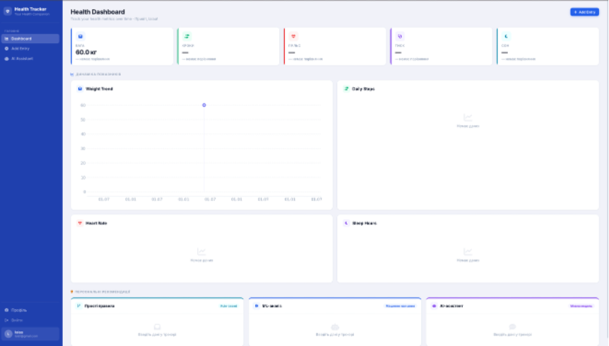
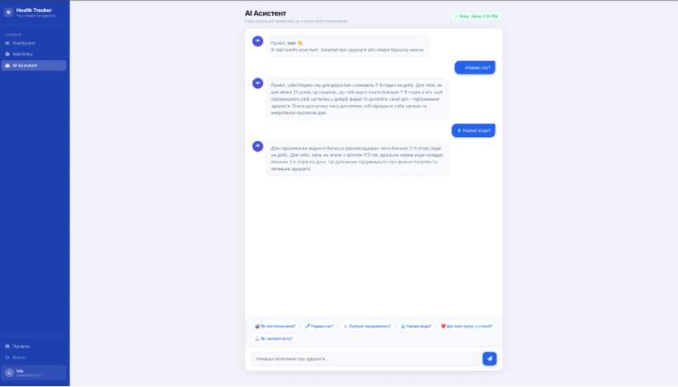
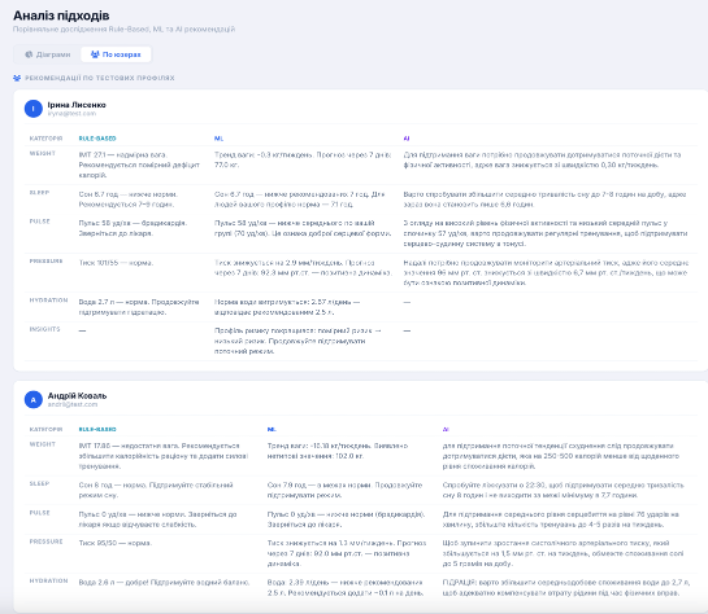

# Health Tracker

Вебсистема відстеження здоров'я з AI-асистентом та трьома підходами до формування персоналізованих рекомендацій: rule-based, machine learning та AI (LLM).

---

## Автор

- ПІБ: Васильєва Софія
- Група: ФеС-42
- Керівник: — Колич Ігор, доцент
- Дата виконання: 29.05.2026

---

## Загальна інформація

- Тип проєкту: Вебзастосунок
- Мова програмування: Python 3.13
- Фреймворки / Бібліотеки: Flask, scikit-learn, Groq API, Jinja2, SQLite
- Посилання на GitHub: https://github.com/sofiiavasylieva/health-tracker.git
---

## Опис функціоналу

- Реєстрація, авторизація та онбординг користувача
- Введення щоденних показників здоров'я (вага, пульс, тиск, сон, активність, гідратація)
- Генерація персоналізованих рекомендацій трьома підходами:
  - Rule-based — на основі порогових значень
  - ML — кластеризація KMeans, лінійна регресія, IsolationForest, кореляція Пірсона
  - AI — модель llama-3.3-70b через Groq API
- AI-асистент у форматі чату
- Графіки динаміки показників на дашборді
- Калькулятори ІМТ та добової норми калорій
- Адміністративна сторінка дослідження ефективності підходів

---

## Опис основних файлів

| Файл / Папка | Призначення |
|--------------|-------------|
| app.py | Головний файл — клас HealthTrackerApp, маршрути Flask |
| recommenders/ml_recommender.py | ML-модуль рекомендацій |
| recommenders/ai_recommender.py | AI-модуль рекомендацій (Groq API) |
| health_tracker.db | База даних SQLite |
| personalised_dataset_clean.csv | Навчальний датасет (2000 записів) |
| templates/ | HTML-шаблони (Jinja2) |
| static/css/modern.css | Стилі інтерфейсу |
| .env | Змінні середовища (GROQ_API_KEY) |

---

## Як запустити проєкт

### 1. Встановлення інструментів

- Python 3.13: https://www.python.org/downloads/
- При встановленні на Windows поставити галочку «Add Python to PATH»
- pip встановлюється автоматично разом з Python

Перевірка:
```bash
python3 --version
pip3 --version
```

### 2. Клонування репозиторію

```bash
git clone https://github.com/sofiiavasylieva/health-tracker.git
cd health-tracker
```

### 3. Створення та активація віртуального середовища

```bash
python3 -m venv venv

# macOS/Linux
source venv/bin/activate

# Windows
venv\Scripts\activate
```

Після активації в терміналі з'явиться (venv).

### 4. Встановлення залежностей

```bash
pip install -r requirements.txt
```


### 5. Завантаження ресурсів
ML-модель навчається автоматично при першому запуску — окремого завантаження не потрібно.

Модель llama-3.3-70b використовується через Groq API — локальне завантаження не потрібне.
Необхідно лише отримати безкоштовний API ключ: https://console.groq.com


### 6. Копіювання .env.example і заповнення своїми даними:

```bash
cp .env.example .env
```

Отримати безкоштовний Groq API ключ: https://console.groq.com

### 7. Запуск

```bash
python app.py
```

Відкрий браузер: http://localhost:5003

---

### 8. Тестові облікові записи

База даних вже містить тестові профілі з усіма правами.

| Email | Пароль | Роль |
|-------|--------|------|
| andrii@test.com | password123 | Адміністратор |
| olena@test.com | password123 | Користувач |
| vasyl@test.com | password123 | Користувач |

### 9. Зробити адміна вручну (якщо потрібно для нового користувача)

```bash
python make_admin.py email@example.com
```

## Інструкція для користувача

1. Реєстрація — створи обліковий запис і заповни профіль на онбордингу
2. Дашборд — переглядай графіки динаміки показників
3. Трекер — щодня вводь показники здоров'я
4. Рекомендації — після введення даних система автоматично генерує рекомендації трьома підходами
5. AI-чат — спілкуйся з AI-асистентом щодо стану здоров'я
6. Калькулятори — розрахуй ІМТ та добову норму калорій

---

## Основні маршрути

| Маршрут | Метод | Опис |
|---------|-------|------|
| / | GET | Головна сторінка / дашборд |
| /register | GET/POST | Реєстрація |
| /login | GET/POST | Авторизація |
| /tracker | GET/POST | Введення показників |
| /ai_agent | GET | AI-асистент чат |
| /research | GET | Дослідження (адмін) |
| /profile | GET/POST | Профіль користувача |


## Запуск тестів

```bash
pytest tests/ -v
```

---
## Скриншоти


| Дашборд | AI-асистент | Адміністративна сторінка |
|---------|-------------|--------------------------|
|  |  |  |


## Проблеми і рішення

| Проблема | Рішення |
|----------|---------|
| ModuleNotFoundError | Переконайся що venv активовано і залежності встановлено |
| Database error: duplicate column name | Це нормально — ігнорується автоматично |
| GROQ_API_KEY not found | Перевір що .env файл створено і заповнено |
| Сторінка /research недоступна | Переконайся що користувач є адміном |

## Використані джерела

- Flask Documentation: https://flask.palletsprojects.com
- scikit-learn Documentation: https://scikit-learn.org
- Groq API Documentation: https://console.groq.com/docs
- SQLite Documentation: https://www.sqlite.org/docs.html
- Llama 3 — Meta AI: https://arxiv.org/abs/2407.21783